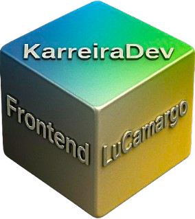

<p align="center">
  <br>
  <sub><strong>KarreiraDev Frontend</strong> – por Luciano Camargo</sub>
</p>

<h1 align="center">🕒 Relógio Digital & Analógico</h1>

<p align="center">
  <b>Um projeto moderno e responsivo em HTML, CSS e JavaScript</b><br>
  Combina <b>Relógio Digital</b> + <b>Relógio Analógico</b> com calendário, GPS e suporte a temas <b>Dark/Light</b>.
</p>

---

## ✨ Funcionalidades

- ⏰ **Relógio Digital** em tempo real com animação glow
- 🕰️ **Relógio Analógico** dinâmico com ponteiros animados
- 📅 **Calendário automático** (data atualizada diariamente)
- 📍 **GPS integrado** (latitude/longitude via navegador)
- 🌙 **Tema Dark/Light** com persistência em `localStorage`
- 🔄 **Alternância de modos** (Digital ↔ Analógico)

---

## 🚀 Demonstração

<p align="center">
  <br>
  <i>Interface com suporte a tema Dark/Light</i>
</p>

🌍 Deploy no **GitHub Pages**:  
👉 [Acessar Relógio Online](https://seu-usuario.github.io/relogio-digital-analogico/)

---

## 🛠️ Tecnologias Utilizadas

<p align="center">
  
  
  
  
  
</p>

- **HTML5** → estrutura do projeto
- **CSS3** → estilização, animações e tema Dark/Light
- **JavaScript (ES6)** → lógica do relógio, calendário, GPS e alternância de modos
- **Font Awesome** → ícones dinâmicos
- **Google Fonts (Roboto)** → tipografia moderna

---

## 📂 Estrutura de Arquivos

/
├── index.html # Estrutura principal da aplicação
├── style.css # Estilos globais e animações
├── script.js # Lógica do relógio, calendário, GPS e alternância
├── logo.png # Logo KarreiraDev Frontend
└── README.md # Documentação do projeto

yaml
Copiar código

---

## 🔑 Principais Funções (script.js)

- `atualizarRelogioDigital()` → mostra a hora digital
- `atualizarRelogioAnalogico()` → atualiza os ponteiros do relógio analógico
- `atualizarData()` → exibe a data no formato DD/MM/AAAA
- `mostrarLocalizacao()` → utiliza a **Geolocation API** para latitude/longitude
- `atualizarIconeTema()` → troca ícones 🌞 ↔ 🌙 no botão de tema
- Event Listeners:
  - `theme-toggle` → alterna Dark/Light
  - `mode-toggle` → alterna Digital/Analógico

---

## 📦 Como Executar

1. Clone o repositório:
   ```bash
   git clone https://github.com/seu-usuario/relogio-digital-analogico.git
   ```


Entre na pasta do projeto:

cd relogio-digital-analogico


Abra o arquivo index.html no navegador 🚀

📌 Roadmap (Ideias Futuras)

🌤️ Exibir clima/temperatura junto ao relógio (usando API externa)

🌐 Traduzir a interface para multi-idiomas (ex: EN/ES/PT)

📱 Melhorar a responsividade com design mobile-first

🎨 Criar mais opções de temas customizados além do Dark/Light

👨‍💻 Autor

Feito com dedicação por Luciano Camargo – KarreiraDev Frontend

<p align="center"> <a href="https://www.linkedin.com/in/seu-linkedin/">  </a> <a href="https://github.com/seu-usuario">  </a> </p> ```